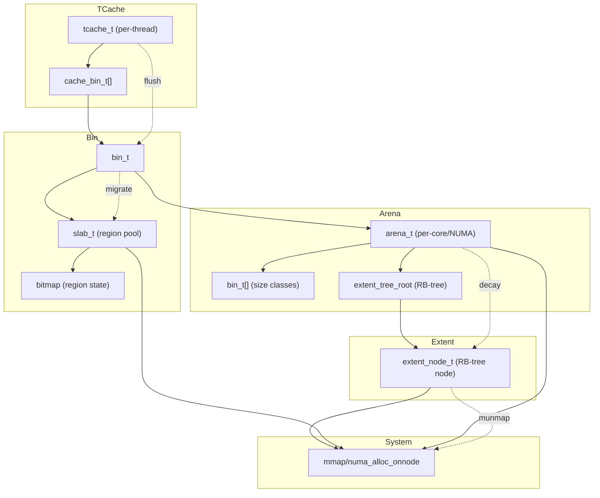

# 模块：arena

## 1. 设计目标与作用
- arena（分配区）是多线程分配的核心单位，减少锁竞争，提升并发性能。
- 每个线程绑定一个 arena，支持 NUMA 感知、负载均衡。
- 管理 bin、slab、extent 等子模块，协调小/大对象分配。

---

## 结构/调用链总览


---

## 2. 关键数据结构

### arena_t
```c
struct arena_s {
    unsigned arena_id;
    unsigned n_threads;
    extent_node_t* extent_tree_root; // 红黑树管理 extent
    bin_t bins[NBINS];
    pthread_mutex_t lock;
    // ...统计、配置参数
} __attribute__((aligned(64)));
```
- 每个 arena 独立管理一组 bin、extent，减少全局锁。
- cacheline 对齐，提升并发。

### extent_node_t
- 见 extent.md，红黑树节点。

---

## 3. 主要算法与实现细节

### 3.1 线程绑定与选择
- 线程启动时绑定 arena，可按 CPU/NUMA 亲和性选择。
- 支持 round-robin、hash、NUMA 感知等策略。

### 3.2 小对象分配
- 通过 bin/slab 管理，优先本地分配，减少跨线程竞争。

### 3.3 大对象分配
- 直接通过 extent 红黑树管理，支持分割、合并。

### 3.4 extent decay
- 定期回收空闲 extent，减少内存滞留。

#### 关键伪代码
```c
arena_t* arena_choose(tsd_t* tsd) {
    if (tsd->arena) return tsd->arena;
    int core = sched_getcpu();
    int node = numa_node_of_cpu(core);
    if (node >= 0) core = node;
    tsd->arena = arenas[core];
    tsd->arena_id = core;
    return tsd->arena;
}

void* arena_malloc_small(arena_t* arena, size_t size) {
    bin_t* bin = &arena->bins[size2bin(size)];
    return bin_malloc_region(bin);
}

void* arena_malloc_large(arena_t* arena, size_t size) {
    return arena_alloc_extent_numa(arena, size);
}
```

---

## 4. 典型调用链
- lmalloc → tcache_alloc → arena_choose → arena_malloc_small/large → bin/extent
- lfree → tcache_dalloc → arena_dalloc_small/large → bin/extent

---

## 5. 调优建议与设计权衡
- 多 arena 提升并发，但需平衡负载与内存碎片。
- NUMA 感知分配可极大提升多核/多节点系统性能。
- extent decay 策略可减少内存滞留，但过于激进可能增加分配/回收开销。
- 可扩展为 per-core/NUMA arena、动态 arena 数量。
- 支持后台线程回收、统计与调优。

---

## 6. 相关文件
- include/arena.h, include/arena_struct.h, src/arena.c 