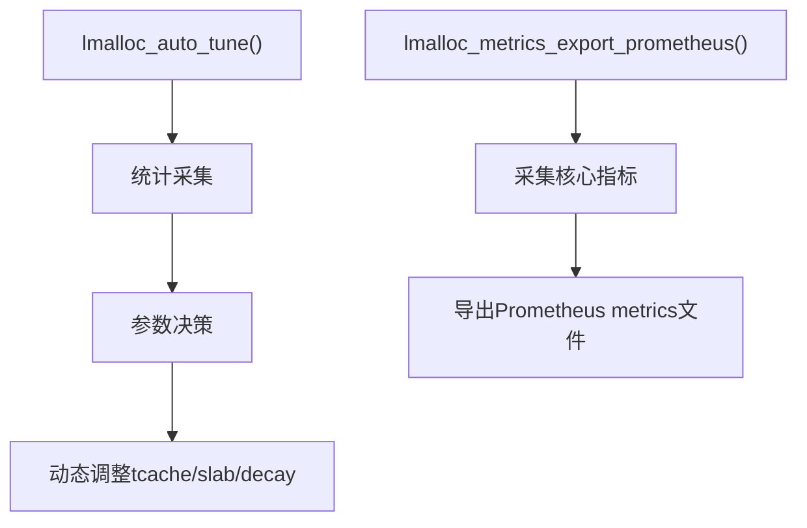

# 模块:auto_tune & metrics

## 1. 设计目标与作用
- 实现分配器的自动调优（自愈）与可观测性，提升线上稳定性与运维效率。
- 自动根据实时统计（如碎片率、分配/回收比、内存峰值等）调整tcache/slab/decay等参数。
- 导出Prometheus风格metrics，便于与现代监控系统集成，实现自动化报警与分析。

---

## 2. 结构/调用链总览


---

## 3. 关键数据结构
```c
struct lmalloc_stats_s {
    _Atomic size_t alloc_count;
    _Atomic size_t free_count;
    _Atomic size_t current_bytes;
    _Atomic size_t peak_bytes;
};
extern struct lmalloc_stats_s g_lmalloc_stats;
```
- 支持多线程安全统计，便于并发环境下的实时采集。

---

## 4. 主要算法与实现细节

### 4.1 自动调优核心流程
- 周期性或手动调用`lmalloc_auto_tune()`：
  1. 采集当前分配/回收/峰值/碎片率等统计。
  2. 根据碎片率等指标，动态调整tcache/slab/decay等参数。
  3. 支持扩展NUMA/热点/分配失败等多维度自适应。

#### 伪代码
```c
void lmalloc_auto_tune(void) {
    size_t cur = atomic_load(&g_lmalloc_stats.current_bytes);
    size_t peak = atomic_load(&g_lmalloc_stats.peak_bytes);
    double frag = (peak > 0) ? (double)(peak - cur) / peak : 0.0;
    if (frag > 0.3) {
        // 碎片率高，收缩tcache/slab，缩短decay周期
    } else if (frag < 0.1) {
        // 碎片率低，适当扩容tcache/slab，延长decay周期
    }
    // 可扩展：NUMA/热点/分配失败等
}
```

### 4.2 Prometheus metrics导出流程
- 调用`lmalloc_metrics_export_prometheus(filename)`：
  1. 采集分配/回收次数、当前/峰值内存等核心指标。
  2. 以Prometheus标准格式导出到文件，便于监控系统采集。
  3. 可扩展NUMA/大页/decay/tcache/slab等详细指标。

#### 伪代码
```c
void lmalloc_metrics_export_prometheus(const char* filename) {
    FILE* f = fopen(filename, "w");
    fprintf(f, "# HELP lmalloc_alloc_count Total allocation count\n");
    fprintf(f, "lmalloc_alloc_count %zu\n", ...);
    // ... 其他指标 ...
    fclose(f);
}
```

---

## 5. 典型调用链
- 自动调优：
  - 定时任务/信号/后台线程 → lmalloc_auto_tune() → 动态调整参数
- metrics导出：
  - 定时任务/信号/后台线程 → lmalloc_metrics_export_prometheus() → 监控系统采集

---

## 6. 并发/NUMA/安全/调试细节
- 所有统计均为_Atomic类型，支持多线程安全采集。
- 可扩展为NUMA节点/大页/热点等多维度指标。
- 支持与profile、heap dump、leak检测等调试工具协同。
- 可通过信号/定时任务/后台线程自动触发，适合生产环境自愈与自动化运维。

---

## 7. 设计权衡与扩展点
- 调优粒度与性能开销需平衡，避免频繁调整带来抖动。
- 可扩展更智能的自适应算法（如机器学习/历史趋势分析）。
- metrics可扩展为更细粒度的分配/NUMA/大页/热点/失败等监控。
- 支持与Prometheus/Grafana/Alertmanager等系统无缝集成。

---

## 8. 典型用法
```c
// 自动调优
lmalloc_auto_tune();
// 导出Prometheus metrics
lmalloc_metrics_export_prometheus("lmalloc_metrics.prom");
```
- 推荐结合定时任务/信号/后台线程自动调用，实现生产级自愈与可观测性。

---

## 9. 相关文件
- include/lmalloc_stats.h, src/lmalloc_stats.c, example.c, main.c 