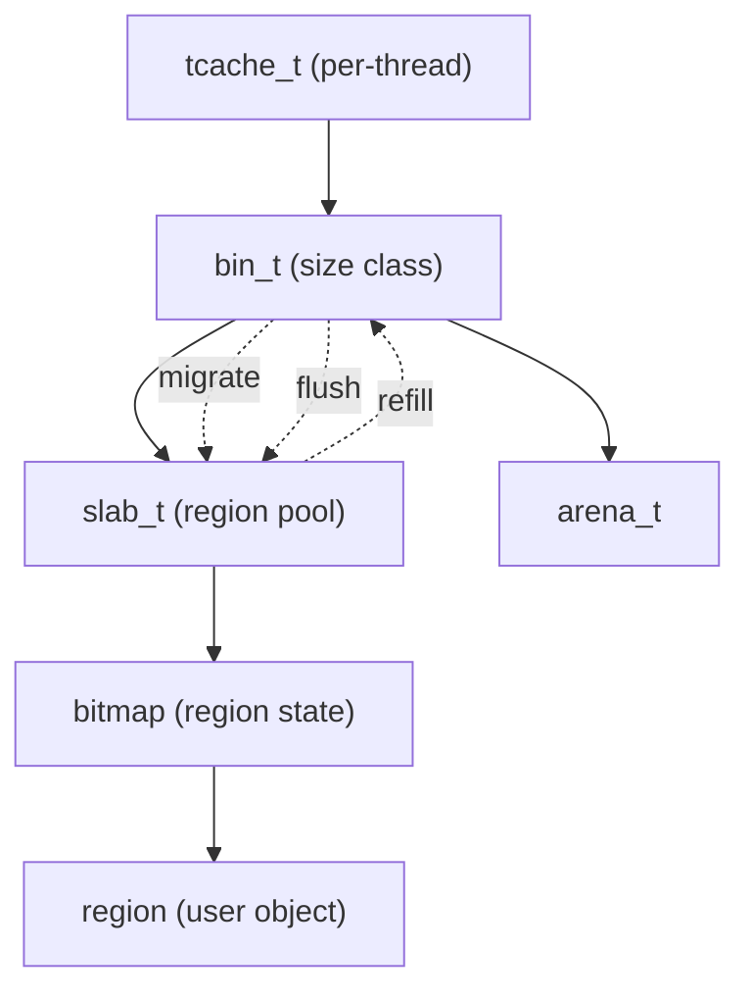

# 模块：bin

## 1. 设计目标与作用
- bin（大小类分配器）负责将小对象分配请求映射到 slab，并管理 slab 内的 region。
- 通过 bitmap 管理 region 分配，支持 slab 迁移、碎片整理。
- 结合 tcache，极大提升小对象分配/回收效率。

---

## 结构/调用链总览


---

## 2. 关键数据结构

### bin_t
```c
struct bin_s {
    slab_t* slabcur; // 当前 slab
    slab_list_t slabs_full, slabs_nonfull, slabs_empty;
    pthread_mutex_t lock;
    // ...统计、配置参数
} __attribute__((aligned(64)));
```
- slabcur 优先分配，减少锁竞争。
- 多链表管理不同利用率 slab，便于 slab 迁移和碎片整理。

### slab_t
- slab 结构体管理一块大内存，内部划分为多个 region。
- 通过 bitmap 管理 region 分配状态。

### region_aux_meta_t
- 紧凑存储 region 辅助元数据（如 LRU、迁移标记等）。

---

## 3. 主要算法与实现细节

### 3.1 region 分配与回收
- 分配：优先 slabcur，bitmap 查找空闲 region。
- 回收：bitmap 标记空闲，必要时 slab 迁移。

#### 关键伪代码
```c
void* bin_malloc_region(bin_t* bin) {
    lock(bin->lock);
    if (slabcur 满) slabcur = slabs_nonfull.head;
    idx = bitmap_find_first_zero(slabcur->bitmap);
    bitmap_set(slabcur->bitmap, idx);
    unlock(bin->lock);
    return slabcur->base + idx * region_size;
}

void bin_dalloc_region(bin_t* bin, void* region) {
    lock(bin->lock);
    idx = region2idx(region);
    bitmap_clear(slabcur->bitmap, idx);
    unlock(bin->lock);
}
```

### 3.2 slab 迁移与碎片整理
- 定期检测低利用率 slab，将 region 迁移到高利用率 slab，减少碎片。
- slab 满/空时自动转移链表。

### 3.3 多链表 slab 管理
- slabs_full/slabs_nonfull/slabs_empty 分别管理不同状态 slab。
- slab 状态变更时链表切换，便于 slab 回收与复用。

---

## 4. 典型调用链
- arena_malloc_small → bin_malloc_region → slab/bitmap
- bin_dalloc_region → slab/bitmap → slab 迁移/整理

---

## 5. 调优建议与设计权衡
- bitmap 管理高效但需注意并发与一致性。
- slab 迁移可扩展为后台线程、NUMA 感知迁移。
- region 辅助元数据可扩展为更丰富的统计与调优。
- slab 大小/region 数量需权衡内存利用率与分配效率。

---

## 6. 相关文件
- include/bin.h, include/bin_struct.h, src/bin.c 

## 7. 结构体字段详细说明

### bin_t 字段
- slabcur：当前 slab，优先分配。
- slabs_full/slabs_nonfull/slabs_empty：不同利用率 slab 链表。
- lock：互斥锁，保护 bin 内部结构。
- ...（可扩展统计、配置参数）

### slab_t 字段
- base：slab 起始地址。
- bitmap：region 分配状态。
- used：已分配 region 数。
- ...（可扩展迁移、统计字段）

## 8. 典型应用场景
- 高频小对象分配（如哈希表节点、链表元素）。
- 需要高效碎片整理与 slab 迁移的场景。

## 9. 与其它模块协作
- 与 tcache 协作：tcache miss/refill 时批量分配/回收。
- 与 arena 协作：slab 分配/回收由 arena 管理。
- 与 profile/security 协作：分配/回收时触发 profile 记录与安全校验。 