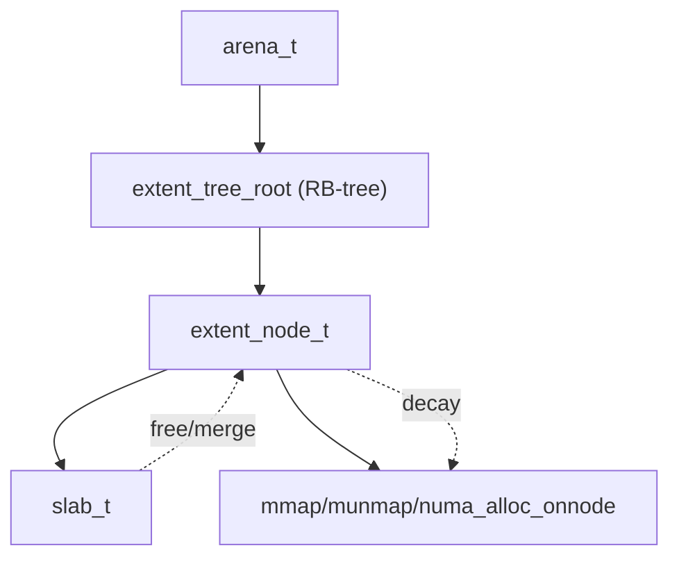

# 模块：extent

## 1. 设计目标与作用
- extent（大块内存管理单元）负责管理从操作系统分配的大块内存。
- 支持分割、合并、回收、NUMA 感知分配。
- 采用红黑树（RB-tree）高效管理空闲 extent，支持 best-fit 分配。

---

## 结构/调用链总览


---

## 2. 关键数据结构

### extent_node_t
```c
struct extent_node_s {
    void* addr;
    size_t size;
    extent_node_t *parent, *left, *right; // RB-tree
    int color;
    extent_node_t *prev, *next; // 双向链表
    time_t free_time; // 回收时间
};
```
- 作为红黑树节点，支持高效插入、删除、查找。
- 记录空闲时间，支持 decay 策略。

### extent_tree_root
- 红黑树根节点，管理所有空闲 extent。

---

## 3. 主要算法与实现细节

### 3.1 红黑树管理
- 所有空闲 extent 以 size 为 key 构建红黑树。
- 支持 best-fit 分配、合并相邻 extent。
- 插入/删除操作需维护红黑树性质。

#### 关键伪代码
```c
extent_node_t* extent_tree_best_fit(root, size) {
    node = root;
    best = NULL;
    while (node) {
        if (node->size >= size) {
            best = node;
            node = node->left;
        } else {
            node = node->right;
        }
    }
    return best;
}
```

### 3.2 分割与合并
- 分配时，若找到的 extent 大于需求，自动分割。
- 回收时，自动合并相邻空闲 extent，减少碎片。

### 3.3 decay 策略
- 空闲 extent 超过阈值或时间自动回收（mmap/munmap）。
- 支持 time-based、threshold-based 策略。

### 3.4 NUMA 感知分配
- extent 分配时可根据线程 NUMA 节点选择本地内存。

---

## 4. 典型调用链
- arena_alloc_extent_tree → extent_tree_best_fit/insert/split
- arena_free_extent_tree → extent_tree_insert/merge

---

## 5. 调优建议与设计权衡
- 红黑树管理高效但实现复杂，需注意一致性。
- decay 策略可扩展为后台线程回收。
- NUMA 感知可扩展为跨节点迁移。
- extent 大小/分配策略需权衡碎片率与分配效率。

---

## 6. 相关文件
- include/arena_struct.h, src/arena.c, src/extent_mmap.c 