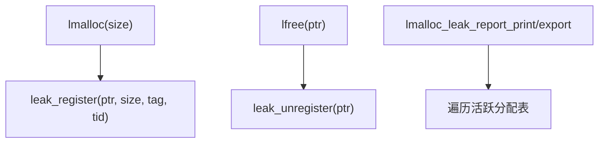

# 模块:leak detection

## 1. 设计目标与作用
- 自动追踪所有分配对象，检测未释放内存，实现高效的内存泄漏检测与报告。
- 支持泄漏对象的详细导出（文本/JSON），便于自动化分析与定位。
- 支持调用栈采集、分配时间筛选、标签归因等，提升定位效率。

---

## 2. 结构/调用链总览


---

## 3. 关键数据结构
```c
typedef struct lmalloc_leak_info_s {
    void* ptr;
    size_t size;
    time_t alloc_time;
    const char* tag;
    uint32_t thread_id;
    void* callstack[8];
    int callstack_depth;
} lmalloc_leak_info_t;

// 活跃分配表（哈希表或链表实现）
// 支持多线程安全，便于高并发环境下追踪
```

---

## 4. 主要算法与实现细节

### 4.1 分配与注册
- 分配时调用`leak_register(ptr, size, tag, tid)`，将分配对象信息插入活跃分配表。
- 记录分配时间、标签、线程ID、调用栈等辅助信息。

### 4.2 释放与注销
- 释放时调用`leak_unregister(ptr)`，从活跃分配表移除对应对象。

### 4.3 泄漏检测与报告
- 调用`lmalloc_leak_report_print(min_age_sec)`或`lmalloc_leak_report_export(filename, min_age_sec)`，遍历活跃分配表，筛选出存活时间超过阈值的对象，打印或导出详细信息。
- 支持文本/JSON等多种格式，便于自动化分析。

#### 伪代码
```c
void leak_register(void* ptr, size_t size, const char* tag, uint32_t tid) {
    // 插入活跃分配表，记录分配信息
}
void leak_unregister(void* ptr) {
    // 从活跃分配表移除
}
void lmalloc_leak_report_export(const char* filename, time_t min_age_sec) {
    // 遍历活跃分配表，筛选并导出
}
```

---

## 5. 典型调用链
- lmalloc/lfree → leak_register/leak_unregister
- lmalloc_leak_report_print/export → 遍历活跃分配表

---

## 6. 并发/NUMA/安全/调试细节
- 活跃分配表用互斥锁或原子操作保护，支持多线程安全。
- 可扩展为NUMA节点/线程本地泄漏检测。
- 支持与profile、tag、auto_tune等模块协同。
- 支持调用栈采集，便于定位分配源。

---

## 7. 设计权衡与扩展点
- 活跃分配表需平衡性能与内存占用。
- 可扩展为分配对象分组、标签/线程/时间等多维度筛选。
- 支持自动周期性泄漏检测与报警。
- 可与Prometheus metrics、自动调优等协同。

---

## 8. 典型用法
```c
void* p = lmalloc(128);
// ...
lmalloc_leak_report_print(0); // 打印所有存活分配
lmalloc_leak_report_export("leak_report.json", 0); // 导出JSON
```

---

## 9. 相关文件
- include/lmalloc_leak.h, src/lmalloc_leak.c, example.c 