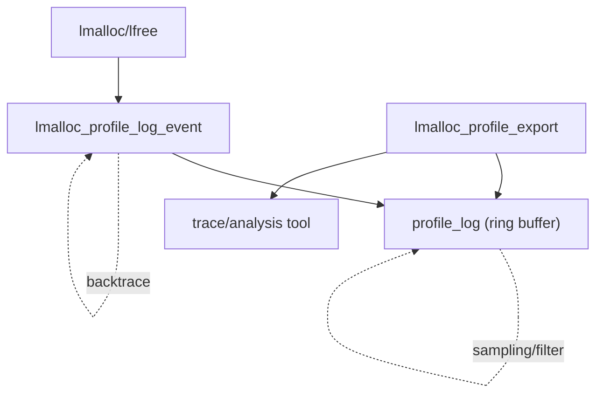

# 模块：profile（堆分析与追踪）

## 1. 设计目标与作用
- profile 模块用于实时追踪内存分配/释放事件，支持堆快照、泄漏检测、热点分析。
- 低开销采样，支持多线程并发。
- 可导出详细分配日志，便于离线分析。

---

## 结构/事件流总览


---

## 2. 关键数据结构

### profile_event_t
- 记录分配/释放事件（指针、大小、时间、调用栈等）。

### profile_log
- 环形缓冲区或链表，存储采样事件。

---

## 3. 主要算法与实现细节

### 3.1 事件采样与记录
- 分配/释放时采样，记录事件到 profile_log。
- 支持采样率、过滤条件配置。

#### 关键伪代码
```c
void lmalloc_profile_log_event(void* ptr, size_t size, int type) {
    event = alloc_event();
    event->ptr = ptr;
    event->size = size;
    event->type = type;
    event->time = now();
    backtrace(event->stack, ...);
    profile_log_push(event);
}
```

### 3.2 调用栈采集
- 使用 backtrace() 获取分配/释放时的调用栈。
- 可选采集深度，支持符号化。

### 3.3 日志导出与快照
- 支持定时/手动导出 profile_log 到文件。
- 导出格式便于与分析工具对接。

---

## 4. 典型分析流程
- lmalloc/lfree → lmalloc_profile_log_event → profile_log_push
- lmalloc_profile_export → 导出 profile 日志
- 分析工具（如 jeprof/heaptrack/自定义脚本）解析 profile.json，定位热点/泄漏/调用链

---

## 5. 调优建议与设计权衡
- 采样率与性能开销需权衡。
- 可扩展为实时分析、内存热点可视化。
- 日志格式可扩展为 protobuf、JSON 等。
- 多线程下建议使用 lock-free 环形缓冲区。

---

## 6. 相关文件
- src/lmalloc_stats.c, lmalloc.h, include/lmalloc_inline.h 