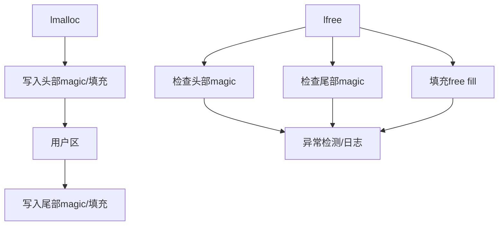

# 模块：security（安全与健壮性）

## 1. 设计目标与作用
- 提供分配/释放安全保障，防止常见内存错误（越界、重释放、UAF、信息泄漏等）。
- 便于调试、定位内存问题。

---

## 内存安全检测流程


---

## 2. 关键安全机制

### 2.1 magic 字节与填充
- 分配头/尾写入 magic（如 LMAGIC_ALLOC/LMAGIC_FREED/LMAGIC_TAIL）。
- 分配填充 0xAA，释放填充 0xDD，便于检测 UAF/越界。

### 2.2 双重释放/越界检测
- lfree 检查头/尾 magic，发现异常立即报错。
- 检查分配区间，防止越界写。

### 2.3 线程安全与原子操作
- 关键路径加锁或原子操作，防止竞态。

### 2.4 内存对齐与缓冲区溢出防护
- 分配对齐，防止未对齐访问。
- 头/尾 magic 检查缓冲区溢出。

---

## 3. 主要实现细节

#### 关键伪代码
```c
void* lmalloc(size_t size) {
    hdr = malloc(...);
    hdr->magic = LMAGIC_ALLOC;
    memset(hdr->head_guard, LMAGIC_PAD, ...);
    memset(user_ptr, 0xAA, size);
    memset(tail, LMAGIC_TAIL, ...);
    return user_ptr;
}

void lfree(void* ptr) {
    hdr = ...;
    if (hdr->magic != LMAGIC_ALLOC) error();
    check_head_magic(hdr);
    check_tail_magic(hdr);
    memset(user_ptr, 0xDD, size);
    hdr->magic = LMAGIC_FREED;
    free(hdr);
}
```

---

## 4. 典型检测链
- lmalloc → magic 填充 → 用户区
- lfree → magic 校验 → 填充 → 回收
- 检测到异常立即输出日志，便于定位

---

## 5. 调优建议与设计权衡
- magic 检查提升健壮性但有一定性能开销。
- 可扩展为 ASan、堆栈保护、隔离区等更强安全机制。
- 检查粒度/填充值可根据调试/生产需求灵活调整。

---

## 6. 相关文件
- lmalloc.h, include/lmalloc_inline.h, src/lmalloc_stats.c 