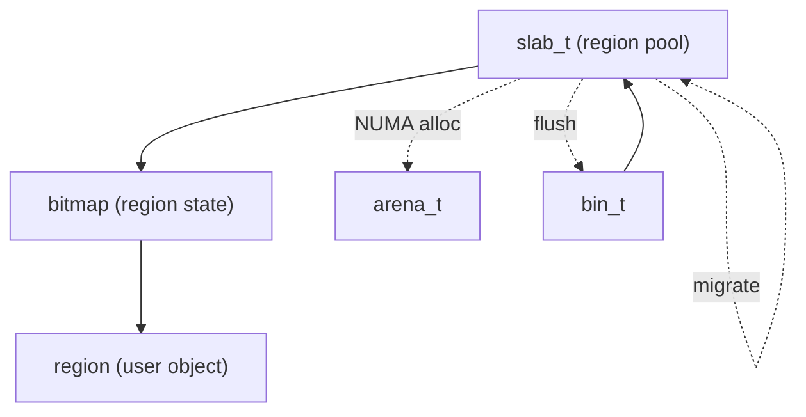

# 模块：slab

## 1. 设计目标与作用
- slab（小块分配页）是 bin 管理的小对象分配单元。
- 每个 slab 被划分为多个等大 region，通过 bitmap 管理分配。
- 支持 slab 迁移、碎片整理、NUMA 感知分配。

---

## 结构/调用链总览


---

## 2. 关键数据结构

### slab_t
- slab 结构体管理一块大内存，内部划分为多个 region。
- 通过 bitmap 管理 region 分配状态。
- 记录 region 利用率、迁移状态等。

### region_aux_meta_t
- 存储 region 的 LRU、迁移等辅助信息。

---

## 3. 主要算法与实现细节

### 3.1 region 分配与回收
- 分配：bitmap 查找空闲 region，分配后更新 bitmap。
- 回收：bitmap 标记空闲，必要时 slab 迁移。

#### 关键伪代码
```c
int slab_alloc_region(slab_t* slab) {
    idx = bitmap_find_first_zero(slab->bitmap);
    if (idx < 0) return -1;
    bitmap_set(slab->bitmap, idx);
    slab->used++;
    return idx;
}

void slab_free_region(slab_t* slab, int idx) {
    bitmap_clear(slab->bitmap, idx);
    slab->used--;
}
```

### 3.2 slab 迁移与碎片整理
- slab 利用率低时，region 可迁移到其他 slab，减少碎片。
- slab 满/空时自动切换链表。

### 3.3 NUMA 感知分配
- slab 分配时可根据线程 NUMA 节点选择本地内存。

---

## 4. 典型调用链
- bin_malloc_region → slab_alloc_region → bitmap
- bin_dalloc_region → slab_free_region → slab 迁移

---

## 5. 调优建议与设计权衡
- bitmap 管理高效但需注意并发。
- slab 迁移可扩展为后台线程、NUMA 感知。
- region 辅助元数据可扩展为更丰富的统计与调优。
- slab 大小/region 数量需权衡内存利用率与分配效率。

---

## 6. 相关文件
- include/bin.h, include/bin_struct.h, src/bin.c 

## 7. 结构体字段详细说明

### slab_t 字段
- base：slab 起始地址。
- bitmap：region 分配状态。
- used：已分配 region 数。
- ...（可扩展迁移、统计字段）

### region_aux_meta_t 字段
- lru：LRU 计数。
- migrate_flag：迁移标记。
- ...（可扩展统计、调优字段）

## 8. 典型应用场景
- 高频小对象分配，需高效碎片整理。
- slab 迁移、NUMA 感知分配场景。

## 9. 与其它模块协作
- 与 bin 协作：bin 管理 slab 分配/回收。
- 与 arena 协作：slab 分配/回收由 arena 管理。
- 与 tcache 协作：tcache miss/refill 时 slab 参与分配。 