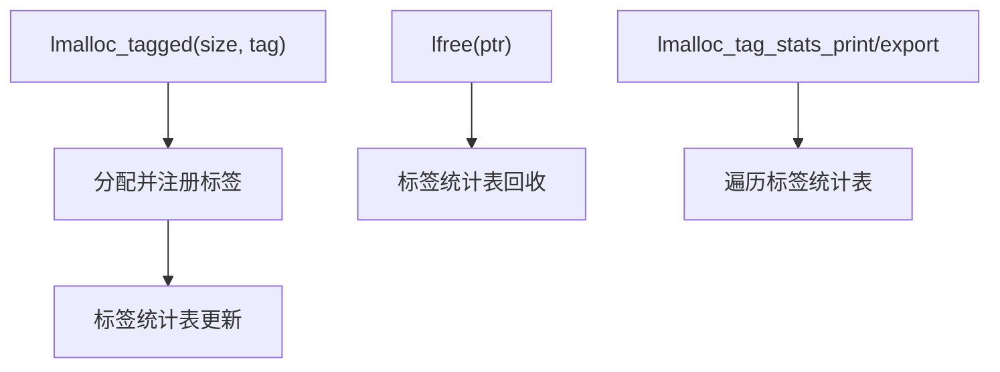

# 模块:tagging & stats

## 1. 设计目标与作用
- 支持分配时为内存块打标签，实现分组统计、热点分析、分配归因。
- 便于定位内存热点、优化缓存/会话/缓冲区等场景。
- 支持标签统计的打印、导出（文本/JSON），便于自动化分析与监控。

---

## 2. 结构/调用链总览


---

## 3. 关键数据结构
```c
typedef struct lmalloc_tag_stat_s {
    _Atomic size_t alloc_count;
    _Atomic size_t free_count;
    _Atomic size_t current_bytes;
    _Atomic size_t peak_bytes;
} lmalloc_tag_stat_t;

// 标签统计表（哈希表实现）
typedef struct tag_entry_s {
    char* tag;
    lmalloc_tag_stat_t stat;
    struct tag_entry_s* next;
} tag_entry_t;
static tag_entry_t* tag_table[TAG_TABLE_SIZE];
```
- 多线程环境下用互斥锁保护，保证统计一致性。

---

## 4. 主要算法与实现细节

### 4.1 标签分配与统计
- 分配时调用`lmalloc_tagged(size, tag)`，在标签哈希表中查找/创建对应统计项。
- 分配/释放时分别更新alloc_count/free_count/current_bytes/peak_bytes。
- 支持多线程安全，采用互斥锁保护哈希表。

#### 伪代码
```c
void* lmalloc_tagged(size_t size, const char* tag) {
    void* p = lmalloc(size);
    lock(tag_table_mutex);
    tag_entry_t* e = tag_entry_find_or_create(tag);
    e->stat.alloc_count++;
    e->stat.current_bytes += size;
    if (e->stat.current_bytes > e->stat.peak_bytes)
        e->stat.peak_bytes = e->stat.current_bytes;
    unlock(tag_table_mutex);
    return p;
}

void lfree(void* ptr) {
    // ...
    lock(tag_table_mutex);
    tag_entry_t* e = tag_entry_find(tag);
    e->stat.free_count++;
    e->stat.current_bytes -= size;
    unlock(tag_table_mutex);
}
```

### 4.2 标签统计打印与导出
- 遍历哈希表，打印/导出所有标签的统计信息。
- 支持文本/JSON等多种格式，便于自动化分析。

---

## 5. 典型调用链
- lmalloc_tagged → 标签统计表更新
- lfree → 标签统计表回收
- lmalloc_tag_stats_print/export → 遍历统计表

---

## 6. 并发/NUMA/安全/调试细节
- 标签统计表用互斥锁保护，支持多线程安全。
- 标签字符串采用哈希表管理，支持高并发场景。
- 可扩展为NUMA节点/线程本地标签统计。
- 支持与profile、leak、auto_tune等模块协同。

---

## 7. 设计权衡与扩展点
- 哈希表冲突需平衡性能与内存占用。
- 可扩展为更细粒度的标签分组（如多级标签、正则分组等）。
- 支持标签生命周期管理、自动清理。
- 可与Prometheus metrics、自动调优等协同。

---

## 8. 典型用法
```c
void* p = lmalloc_tagged(256, "session");
lfree(p);
lmalloc_tag_stats_print();
lmalloc_tag_stats_export("tag_stats.json");
```

---

## 9. 相关文件
- include/lmalloc_tag.h, src/lmalloc_tag.c, example.c 