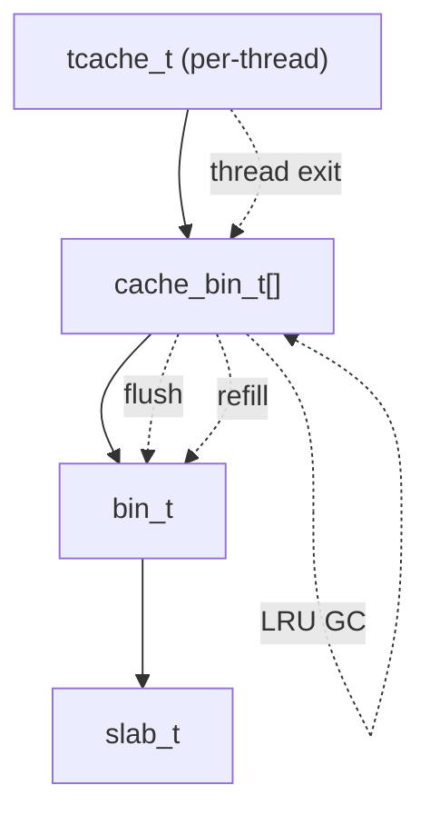

# 模块：tcache

## 1. 设计目标与作用
- tcache（Thread Cache）是每个线程独立的小对象缓存，极大提升小对象分配/回收性能。
- 采用 lock-free 设计，支持高并发、低延迟、NUMA/多核友好。
- 支持自适应容量、LRU GC、析构 flush、线程间迁移。

---

## 结构/调用链总览


---

## 2. 关键数据结构

### tcache_t
```c
struct tcache_s {
    cache_bin_t bins[TCACHE_NBINS_MAX]; // 每个大小类一个 cache_bin
    atomic_int lock; // lock-free 支持
    // ...统计、配置参数
} __attribute__((aligned(64)));
```
- 每个线程独立一份，避免锁竞争。
- cacheline 对齐，减少 false sharing。

### cache_bin_t
```c
struct cache_bin_s {
    void** stack; // lock-free 指针栈
    int head, capacity, max_capacity, min_capacity;
    unsigned long alloc_hits, alloc_misses, dalloc_hits, dalloc_misses;
    unsigned long last_adjust, last_gc;
    unsigned long* obj_timestamps; // LRU GC
};
```
- lock-free push/pop，极致并发。
- 支持自适应容量、LRU GC。

---

## 3. 主要算法与实现细节

### 3.1 lock-free push/pop
- 使用原子 compare_exchange 实现无锁栈操作。
- 多线程环境下无锁竞争，极大提升并发性能。

#### 关键伪代码
```c
int tcache_bin_push(cache_bin_t* bin, void* ptr) {
    do {
        old_head = atomic_load(&bin->head);
        if (old_head >= bin->capacity) return 0;
        new_head = old_head + 1;
    } while (!atomic_compare_exchange_weak(&bin->head, &old_head, new_head));
    bin->stack[old_head] = ptr;
    return 1;
}
```

### 3.2 自适应容量与 LRU GC
- 根据命中率、溢出率动态扩缩 cache_bin 容量。
- LRU GC：定期淘汰最久未用对象，减少内存滞留。
- 支持线程析构自动 flush，防止内存泄漏。

### 3.3 线程间迁移与析构 flush
- 支持 tcache 对象在线程间迁移（如线程池复用）。
- 线程退出时自动 flush tcache，保证无泄漏。

---

## 4. 典型调用链
- lmalloc → tcache_alloc → lock-free pop → miss/refill → arena/bin
- lfree → tcache_dalloc → lock-free push → 满/GC → arena/bin

---

## 5. 调优建议与设计权衡
- lock-free 设计极致并发，但需注意 ABA 问题和内存回收。
- LRU GC 可扩展为 LFU、后台线程 GC。
- 可扩展为 per-core tcache、NUMA 感知 tcache。
- cache_bin 容量、GC 策略需权衡命中率与内存占用。

---

## 6. 相关文件
- include/tcache.h, include/tcache_struct.h, src/tcache.c 

## 7. 结构体字段详细说明

### tcache_t 字段
- bins：每个大小类一个 cache_bin，独立缓存。
- lock：原子锁，支持 lock-free 操作。
- ...（可扩展统计、配置参数）

### cache_bin_t 字段
- stack：对象指针栈，lock-free。
- head：栈顶索引。
- capacity/max_capacity/min_capacity：当前/最大/最小容量。
- alloc_hits/misses, dalloc_hits/misses：命中/溢出统计。
- last_adjust/last_gc：自适应调整/GC 时间戳。
- obj_timestamps：LRU GC 用于追踪对象活跃度。

## 8. 典型应用场景
- 高频小对象分配/回收（如网络包、消息缓冲区）。
- 多线程高并发分配，极大减少锁竞争。
- 线程池、协程池等场景下的对象复用。

## 9. 与其它模块协作
- 与 bin 协作：tcache miss/refill 时批量向 bin 申请/归还对象。
- 与 arena 协作：tcache 归还对象时，最终通过 bin/arena 回收。
- 与 profile/security 协作：分配/回收时触发 profile 记录与安全校验。 