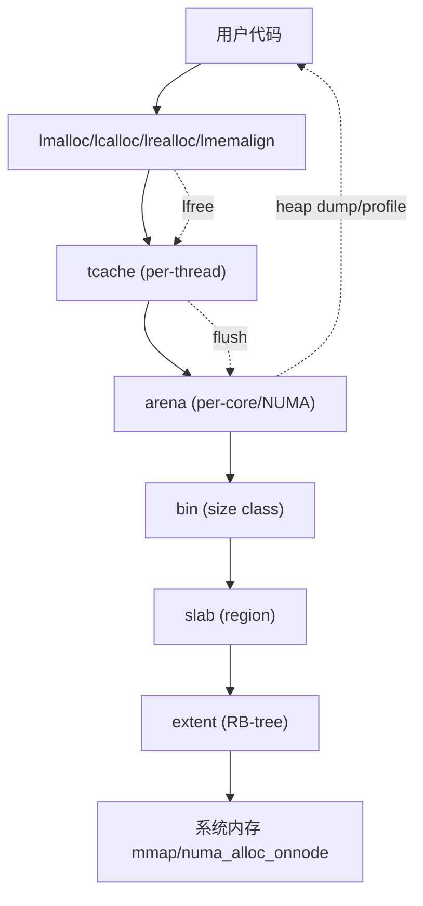

# jemalloc-style 高性能内存分配器使用说明

## 1. 项目概览
本项目是一个高性能、线程安全、NUMA/多核友好、支持 profile/调优/安全特性的 jemalloc 风格内存分配器。适用于高并发、性能敏感、需要内存调试与分析的场景。

---

## 结构/主用法调用链总览


---

## 2. 主要功能特性
- **多级分配体系**：tcache（lock-free）、arena（per-core/NUMA）、bin、slab、extent（红黑树管理）
- **NUMA/多核优化**：线程自动绑定本地 arena，slab/extent NUMA 感知分配
- **lock-free tcache**：极致并发性能，支持线程析构 flush、LRU GC、自适应容量
- **精确元数据与安全特性**：bitmap+compact array、分配/回收填充、magic 校验、越界检测
- **profile/heaptrace/调优接口**：分配/回收路径追踪、周期性导出、heap dump、统计、调用栈采集
- **分配标签与分组统计**：支持分配时打标签，统计/导出各类分配的使用情况
- **内存泄漏检测与报告**：自动追踪所有分配，导出泄漏报告，支持调用栈定位
- **极致性能优化**：cacheline 对齐、likely/unlikely、原子操作、红黑树 O(logN) 管理
- **丰富测试用例**：多线程/多核/NUMA、压力测试、profile 导出、调试分析

---

## 3. 主要接口与用法

### 3.1 基本分配/释放
```c
void* p = lmalloc(128);
lfree(p);
```

### 3.2 带标签分配/释放
```c
void* q = lmalloc_tagged(256, "session");
lfree(q);
```

### 3.3 calloc/realloc/memalign
```c
void* p2 = lcalloc(10, 32);
p2 = lrealloc(p2, 1024);
void* p3 = lmemalign(4096, 256);
lfree(p2);
lfree(p3);
```

### 3.4 多线程分配
```c
pthread_t th[4];
for (int i = 0; i < 4; ++i) pthread_create(&th[i], NULL, thread_func, &i);
for (int i = 0; i < 4; ++i) pthread_join(th[i], NULL);
```

### 3.5 统计与 heap dump
```c
lmalloc_stats_print();
lmalloc_heap_dump();
```

### 3.6 profile 导出与调用栈分析
```c
lmalloc_profile_export("profile.json");
// 可用 addr2line/stacktrace 工具对 profile.json 进行符号化分析
```

### 3.7 标签统计与导出
```c
lmalloc_tag_stats_print();
lmalloc_tag_stats_export("tag_stats.json");
```

### 3.8 泄漏检测与报告
```c
lmalloc_leak_report_print(0); // 打印所有存活分配
lmalloc_leak_report_export("leak_report.json", 0);
```

### 3.9 自动调优与Prometheus metrics导出（新增）
```c
lmalloc_auto_tune(); // 自动调优，适合自愈/自动化运维
lmalloc_metrics_export_prometheus("lmalloc_metrics.prom"); // 导出Prometheus风格metrics，便于监控系统采集
```
- 推荐结合定时任务/信号/后台线程，自动导出metrics并执行自适应调优。
- 典型场景：线上自愈、自动化性能调优、Prometheus+Grafana监控。
- 详见 example.c 的 example_auto_tune_and_metrics()。

---

## 4. 进阶分析与调优建议

### 4.1 调用栈采集与符号化
- 所有分配/释放事件自动采集调用栈，profile/leak 日志可用 `addr2line`、`gdb` 等工具定位。
- 示例：
  ```sh
  addr2line -e your_binary 0xaddress
  ```

### 4.2 标签分组与热点分析
- 通过标签统计可分析不同类型分配的内存占用、峰值、分配/释放次数。
- 适合定位内存热点、优化缓存/会话/缓冲区等场景。

### 4.3 泄漏检测与自动报告
- 自动追踪所有分配，未释放对象可通过 `lmalloc_leak_report_print`/`export` 导出。
- 支持按分配时间筛选（min_age_sec），便于定位长期泄漏。

### 4.4 NUMA/多核优化
- 线程自动绑定本地 arena，提升多核/NUMA 下的分配性能。
- 支持 `-DHAVE_NUMA` 编译选项，需安装 `libnuma`。

### 4.5 性能与安全建议
- lock-free tcache、cacheline 对齐、likely/unlikely 优化主路径性能。
- magic 校验、填充、越界检测提升健壮性。
- 可通过编译选项灵活启用/关闭 profile、NUMA、调试等特性。

---

## 5. 常见问题与FAQ

- **如何集成到我的项目？**
  - 直接 include 头文件，链接静态/动态库，或将源码加入工程。
- **如何替换系统 malloc/free？**
  - 可用宏重定义或 LD_PRELOAD 技术。
- **如何分析 profile/leak 日志？**
  - 用 Python/Go 脚本或 jeprof/heaptrack/addr2line 工具分析导出文件。
- **如何定位内存泄漏？**
  - 运行泄漏检测接口，结合调用栈定位分配源。
- **如何提升多线程/NUMA 性能？**
  - 启用 NUMA 支持，合理设置线程亲和性。

---

## 6. 参考示例
详见 `example.c`，涵盖所有主要功能和典型用法。

---

## 7. 相关文档
- `README.md`：项目总览与编译说明
- `docs/arena.md`、`docs/tcache.md`、`docs/bin.md` 等：各模块详细设计
- `docs/profile.md`、`docs/security.md`：调优与安全机制
- `example.c`：完整用法演示

---

## 8. 当前未实现/待完善特性（stub/TODO）

- size class 细粒度映射和动态扩展（当前为简化版）
- arena/pac/slab 更细粒度的 NUMA/大页/回收策略
- extent 红黑树删除的 fixup（修正）算法
- pac（大块分配）元数据与统计
- slab/region 级别的详细统计与调试接口
- tcache LRU GC、adaptive sizing 的完整实现
- 更丰富的 profile 导出格式与外部分析工具
- 线程安全的 slab migration、bin compaction
- 兼容 glibc malloc 的 mallopt、malloc_usable_size 等接口
- 其他 jemalloc 高级特性（如 background thread、decay 策略等）

如需参与完善或二次开发，建议优先关注上述模块。

---

如有更多问题，欢迎查阅源码、文档或提交 issue！ 